# AI-Powered Domain-Aware Resume Generator — Architecture

## System Overview

The AI-Powered Domain-Aware Resume Generator is a full-stack application that automates professional resume creation using a hybrid ML + LLM architecture. The system accepts user data through either a web interface or Google Forms, classifies the user's professional domain using machine learning, and generates an ATS-optimized resume via Google's Gemini API.

## System Architecture

```mermaid
flowchart TB
    subgraph Input["Input Channels"]
        GF["Google Form"]
        WEB["React Frontend"]
    end

    subgraph Backend["Flask Backend API"]
        direction TB
        WH["Webhook Handler<br/>/webhook"]
        GEN["Generator<br/>/generate"]

        subgraph ML["ML Classification Pipeline"]
            PP["Text Preprocessing"]
            BERT["DistilBERT<br/>(Primary, ~86% F1)"]
            TFIDF["TF-IDF + LR<br/>(Fallback, ~82% F1)"]
            ENS["Ensemble Voting"]
        end

        subgraph AI["AI Generation Pipeline"]
            PE["Domain-Specific<br/>Prompt Engine"]
            GEM["Gemini 1.5 Pro"]
            VAL["Output Validation"]
        end

        subgraph FMT["Formatting Pipeline"]
            HTML["HTML"]
            PDF["PDF (ReportLab)"]
            DOCX["DOCX (python-docx)"]
        end

        EMAIL["Email Service<br/>(SMTP)"]
    end

    GF -->|"Apps Script"| WH
    WEB -->|"Axios POST"| GEN

    WH --> PP
    GEN --> PP

    PP --> BERT
    PP --> TFIDF
    BERT --> ENS
    TFIDF --> ENS

    ENS --> PE
    PE --> GEM
    GEM --> VAL

    VAL --> HTML
    VAL --> PDF
    VAL --> DOCX

    PDF --> EMAIL
    DOCX --> EMAIL

    HTML -->|"Response"| WEB
    EMAIL -->|"Resume"| USER["User Email"]
```



## Technology Stack

| Layer | Technology | Purpose |
|-------|-----------|---------|
| Frontend | React 19, Vite 8, TailwindCSS 4 | Interactive form + resume preview |
| Backend | Python Flask 3, Flask-CORS | REST API server |
| ML (Primary) | DistilBERT (Hugging Face Transformers) | High-accuracy domain classification |
| ML (Fallback) | Scikit-learn (TF-IDF + Logistic Regression) | Lightweight classification |
| AI Generation | Google Gemini 1.5 Pro API | Resume content generation |
| PDF Export | ReportLab | Professional PDF formatting |
| DOCX Export | python-docx | Editable Word document |
| Email | SMTP (Gmail App Password) | Resume delivery |
| Integration | Google Apps Script | Google Forms webhook bridge |

## Data Flow

### Web Frontend Flow
1. User fills out the React form (name, education, skills, etc.)
2. Frontend sends POST to `/generate` endpoint
3. Backend preprocesses text, classifies domain, generates prompt
4. Gemini generates resume content
5. Content is formatted to HTML/PDF/DOCX
6. Response sent back with HTML preview + download links
7. If email provided, resume is also emailed

### Google Forms Flow
1. User fills out the Google Form
2. Apps Script `onFormSubmit` trigger fires
3. Script sends POST to `/webhook` with form data
4. Backend maps field names, processes asynchronously
5. Resume generated and emailed to user
6. Webhook returns 202 Accepted immediately (no timeout)

## ML Pipeline Details

### Domain Classification
The system classifies resumes into 7 domains:

| Domain | Examples |
|--------|----------|
| TECH | Software Engineering, Data Science, IT |
| BUSINESS | Finance, Marketing, Operations |
| CREATIVE | Design, Media, Content Creation |
| HEALTH | Healthcare, Pharma, Clinical |
| LEGAL_ADMIN | Legal, Compliance, Administration |
| EDUCATION | Teaching, Research, Ed-Tech |
| OTHER | Multi-disciplinary |

### Dual-Model Architecture

**DistilBERT (Primary)**
- Fine-tuned on 1,299 real resume samples from Resume.csv
- 5 epochs, batch size 4, learning rate 2e-5
- Weighted cross-entropy loss for class imbalance
- ~86% weighted F1 score

**TF-IDF + Logistic Regression (Fallback)**
- 10,000 max features, English stop words removed
- L-BFGS solver, 1000 max iterations
- ~82% weighted F1 score (5-fold CV)
- <1MB model size, <1ms inference

**Ensemble Mode**
- Weighted average: 70% DistilBERT + 30% TF-IDF
- Probability distributions averaged and renormalized
- Provides confidence scores for each prediction

## API Endpoints

| Endpoint | Method | Description |
|----------|--------|-------------|
| `/` | GET | Health check with model status |
| `/generate` | POST | Full resume generation pipeline |
| `/classify` | POST | Domain classification only |
| `/download/<file>` | GET | Download generated PDF/DOCX |
| `/webhook` | POST | Google Forms webhook receiver |
| `/webhook/status` | GET | Webhook processing log |

## Project Structure

```
PBL/
├── backend/
│   ├── app.py                  # Flask server entry point
│   ├── config.py               # Centralized configuration
│   ├── domain_classifier.py    # Dual-model ML classifier
│   ├── prompt_engine.py        # Domain-specific prompt builder
│   ├── ai_model.py             # Gemini API integration
│   ├── formatter.py            # PDF / DOCX / HTML formatting
│   ├── email_service.py        # SMTP email delivery
│   ├── webhook.py              # Google Forms webhook handler
│   ├── utils.py                # Text preprocessing utilities
│   ├── train_model.py          # TF-IDF model training script
│   ├── .env                    # Environment variables
│   ├── models/                 # Trained ML models
│   │   ├── resume_classifier_model/  # DistilBERT weights
│   │   ├── tfidf_vectorizer.pkl
│   │   ├── resume_classifier.pkl
│   │   ├── label_encoder.pkl
│   │   └── label_mapping.json
│   └── generated/              # Output PDF/DOCX files
├── frontend/
│   ├── src/
│   │   ├── App.jsx
│   │   ├── index.css
│   │   ├── components/
│   │   │   ├── Form.jsx
│   │   │   ├── ResumePreview.jsx
│   │   │   └── Loader.jsx
│   │   └── pages/
│   │       ├── Home.jsx
│   │       └── Result.jsx
│   ├── vite.config.js
│   └── package.json
├── data/
│   └── Resume.csv              # Training dataset (56MB)
├── notebooks/
│   └── evaluation_pipeline.py  # Research metrics generator
├── google_apps_script.js       # Google Forms integration
├── requirements.txt
└── README.md
```

## Deployment Guide

### Local Development
```bash
# Backend
cd backend
pip install -r ../requirements.txt
python app.py  # Runs on :8080

# Frontend
cd frontend
npm install
npm run dev    # Runs on :5173 with proxy to :8080
```

### Production (Railway / Render)
1. Push code to GitHub
2. Connect Railway/Render to the repository
3. Set environment variables in the dashboard
4. Backend build: `pip install -r requirements.txt`
5. Backend start: `gunicorn backend.app:app --bind 0.0.0.0:$PORT`
6. Frontend: build and serve from `frontend/dist/`

### Google Forms Setup
1. Create form with recommended fields (see `google_apps_script.js`)
2. Open Script Editor from the form
3. Paste `google_apps_script.js` contents
4. Update `WEBHOOK_URL` with your deployed backend URL
5. Add installable trigger: `onFormSubmit` → On form submit
6. Authorize and test

## Research Claims Support

This system's architecture supports the following research contributions:

1. **Dual-Model Classification**: Comparison of traditional ML (TF-IDF+LR) vs deep learning (DistilBERT) for resume domain classification
2. **Ensemble Learning**: Weighted probability averaging improves robustness
3. **Domain-Aware Generation**: ATS keyword injection based on ML-predicted domain
4. **Automated Pipeline**: End-to-end automation from Google Forms to email delivery
5. **Quality Assurance**: Multi-dimensional resume scoring (ATS, content, formatting, domain relevance)

Run `python notebooks/evaluation_pipeline.py` to generate all metrics and figures for the paper.
